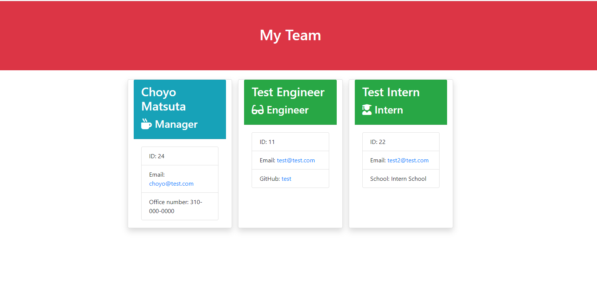
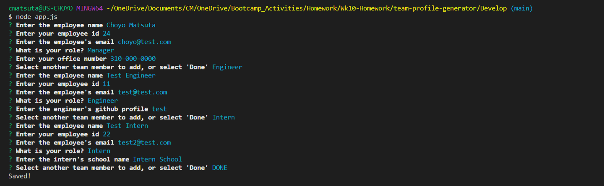
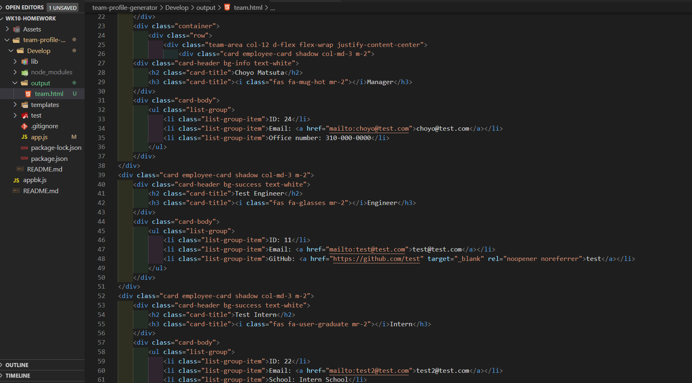
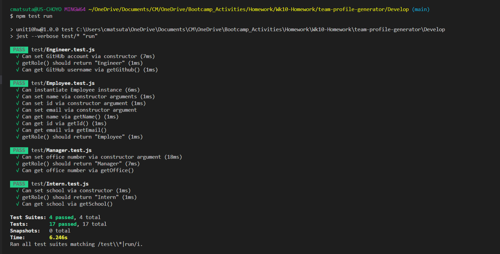

# Team Profile Generator

The project was to build a Node CLI that takes in information about employees and generates an HTML webpage that displays summaries for each person, and ensure that all unit tests pass. 

## Link to deployed app
[Team Profile Generator demo video](https://drive.google.com/file/d/15ZY6YLqzYL65nOnjTtAoRgCgvuKTpEv5/view?usp=sharing)

## App Description
This app will run as a Node CLI to gather information about each employee and generates an HTML webpage that displays summaries for each person.

## Installation
Run `npm i`
The dependencies are, `jest`for running the provided tests, and `inquirer` for collecting input from the user.

## Usage
Run the command `node app.js` to prompt the user for specific information based on their role with the company and generate an HTML page that displays information about their team.

## Tests
Run the tests with `npm run test`

## Contact Information
Choyo Matsuta: [GitHub link](https://github.com/cmatsuta)

### Released under MIT License
Copyright <2020> Choyo Matsuta

Permission is hereby granted, free of charge, to any person obtaining a copy of this software and associated documentation files (the "Software"), to deal in the Software without restriction, including without limitation the rights to use, copy, modify, merge, publish, distribute, sublicense, and/or sell copies of the Software, and to permit persons to whom the Software is furnished to do so, subject to the following conditions:

The above copyright notice and this permission notice shall be included in all copies or substantial portions of the Software.

THE SOFTWARE IS PROVIDED "AS IS", WITHOUT WARRANTY OF ANY KIND, EXPRESS OR IMPLIED, INCLUDING BUT NOT LIMITED TO THE WARRANTIES OF MERCHANTABILITY, FITNESS FOR A PARTICULAR PURPOSE AND NONINFRINGEMENT. IN NO EVENT SHALL THE AUTHORS OR COPYRIGHT HOLDERS BE LIABLE FOR ANY CLAIM, DAMAGES OR OTHER LIABILITY, WHETHER IN AN ACTION OF CONTRACT, TORT OR OTHERWISE, ARISING FROM, OUT OF OR IN CONNECTION WITH THE SOFTWARE OR THE USE OR OTHER DEALINGS IN THE SOFTWARE.